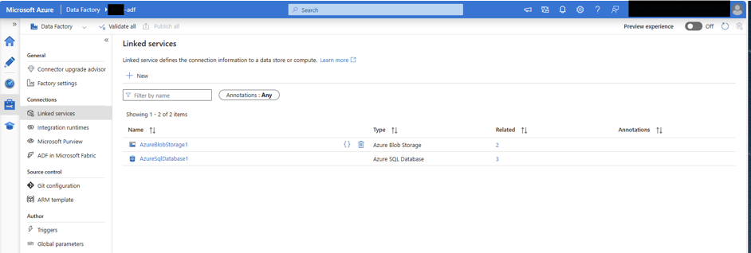
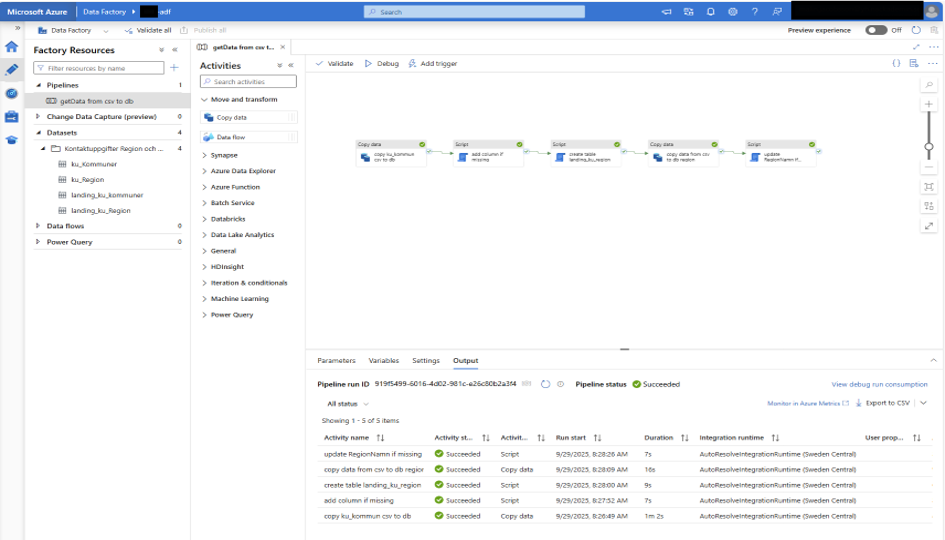
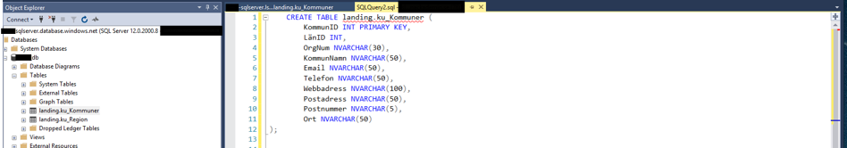
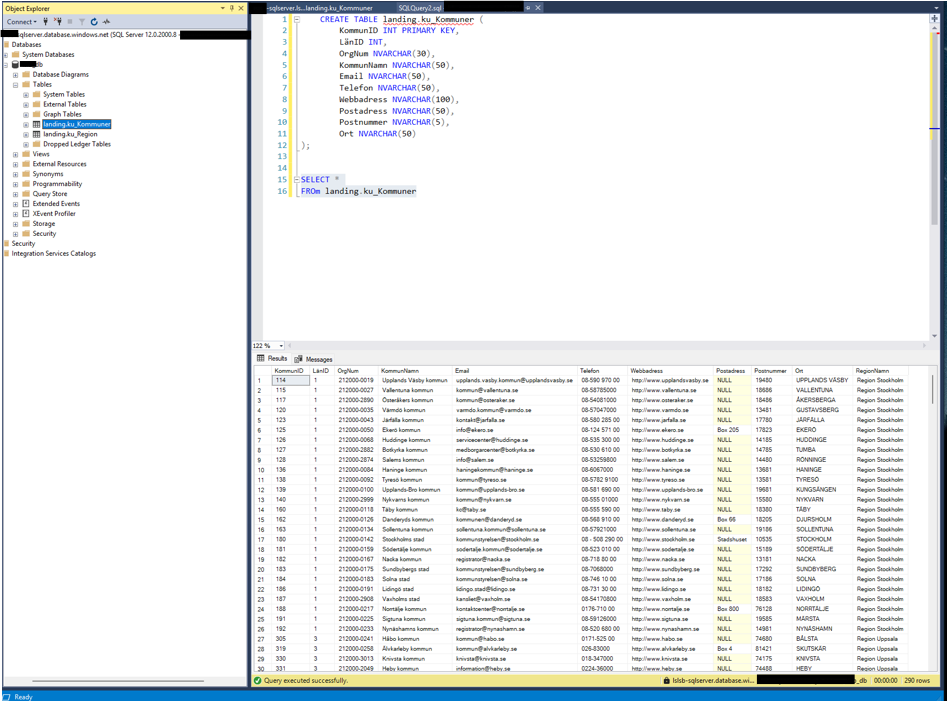
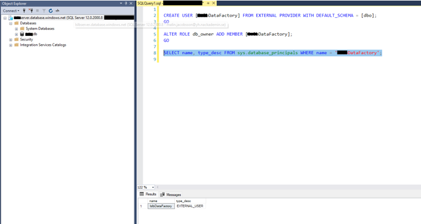

# Azure Data Factory — Cloud ETL Pipeline

> A working Azure data integration: CSV files in Blob Storage → Azure Data Factory pipelines → Azure SQL landing tables, with security configuration and encoding troubleshooting along the way.

Lab from the *Streaming Data & Cloud Solutions* course at Nackademin (BI24).

## What this project demonstrates

- **Azure Data Factory** — linked services, pipelines, copy + script activities
- **Azure SQL** — landing-zone table design (datatypes, primary key selection, constraints)
- **Security** — external user creation and role assignment for the Data Factory service principal
- **Cost awareness** — deliberately built on the free tier of Azure SQL Database
- **Real troubleshooting** — including an ISO-8859-1 encoding fix for Swedish characters

## Architecture

```
Blob Storage (CSV)  ──►  Azure Data Factory  ──►  Azure SQL Database
   municipalities        copy → script → load      landing_ku_Kommuner
                        pipeline                   landing_ku_Region
```

## Linked services

The factory connects to both Blob Storage and Azure SQL:



## Pipeline run

The `getData from csv to db` pipeline — copy data, add missing columns, create the landing table, load region data — all activities succeeded:



## SQL landing zone

`landing_ku_Kommuner` — Swedish municipality contact data with a deliberate key design (`KommunID` as primary key) and `NVARCHAR` chosen for text fields:





## Security configuration

The Data Factory gets its own external user with `db_owner` membership — no shared credentials:



## Lessons learned

- **Encoding matters.** The municipality CSV used ISO-8859-1; without the right encoding setting, Swedish characters (å, ä, ö) broke on load.
- **Free-tier awareness** shaped design choices — small tables, simple pipelines, no unnecessary compute.
- Working end-to-end in a real cloud tenant is different from local scripts: permissions, linked services and activity ordering all have to be right before anything moves.
