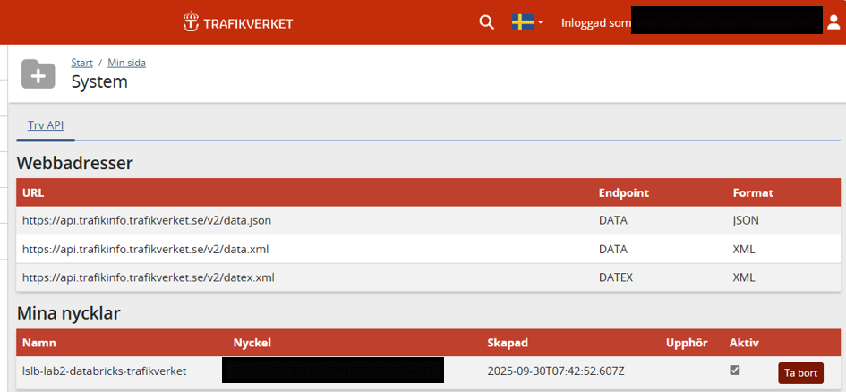
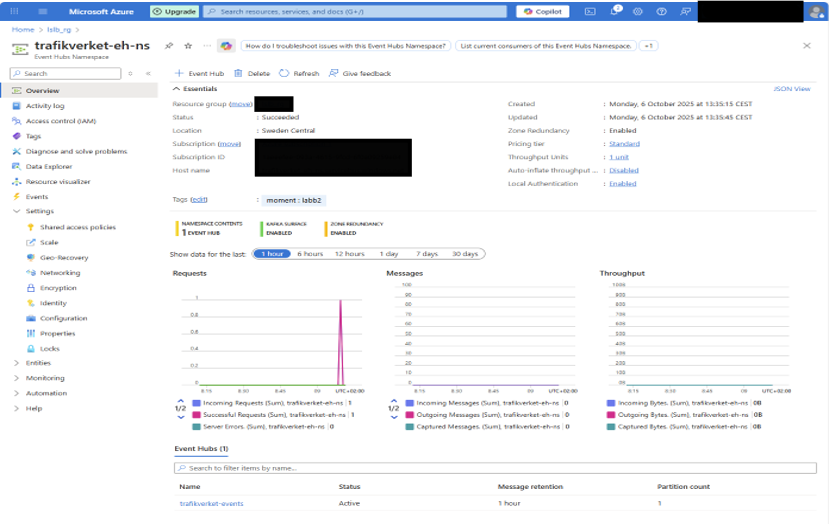
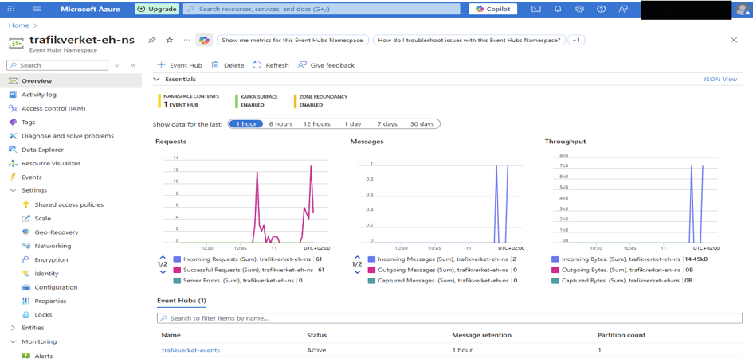
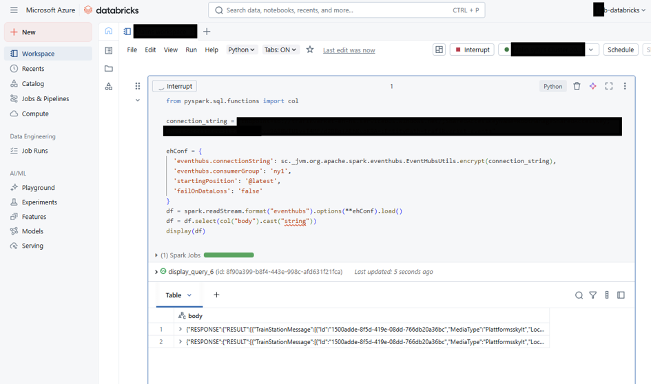

# Azure Streaming Pipeline — Real-time Train Data

> A real-time data pipeline: Trafikverket train events → Azure Event Hub → Databricks (PySpark structured streaming) → Azure SQL landing zone → Azure Data Factory orchestration.

Lab from the *Streaming Data & Cloud Solutions* course at Nackademin (BI24).

## What this project demonstrates

- **Azure Event Hub** — streaming ingestion of live `TrainStationMessage` events from Trafikverket's open API
- **Databricks + PySpark** — `spark.readStream` with consumer groups, starting positions and `failOnDataLoss` configuration
- **JSON parsing** — consuming and validating nested event payloads in real time
- **SQL landing-zone modeling** — datatype and constraint choices for streamed data
- **ADF orchestration** — Data Factory pipelines wired into the Databricks workflow

## Architecture

```
Trafikverket API  ──►  Event Hub  ──►  Databricks (PySpark)  ──►  Azure SQL  ──►  Data Factory
 TrainStationMessage   trafikverket-   spark.readStream          landing zone   load, transform,
                       events          stream consumption                        update
```

## Data source

Trafikverket's open data API — live `TrainStationMessage` events (platform changes, announcements) delivered as JSON:



## Event Hub

The `trafikverket-events` hub receiving real traffic — namespace metrics show incoming messages and bytes:





## Databricks streaming consumer

PySpark structured streaming reading from the Event Hub — encrypted connection string, dedicated consumer group, `@latest` starting position, `failOnDataLoss` disabled for a lab-friendly config — with live `TrainStationMessage` JSON arriving in the display:



## Lessons learned

- **Streaming is different.** Consumer groups, starting positions and data-loss behavior are decisions you have to make explicitly — there's no "just read the file" fallback.
- **End-to-end debugging across four Azure services** taught me more than any single-service tutorial: when data doesn't land, the fault can sit anywhere in the chain.
- Choosing the SQL landing schema for streamed JSON is a real modeling decision — what to flatten, what to keep raw.
