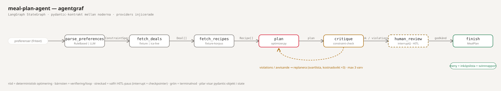
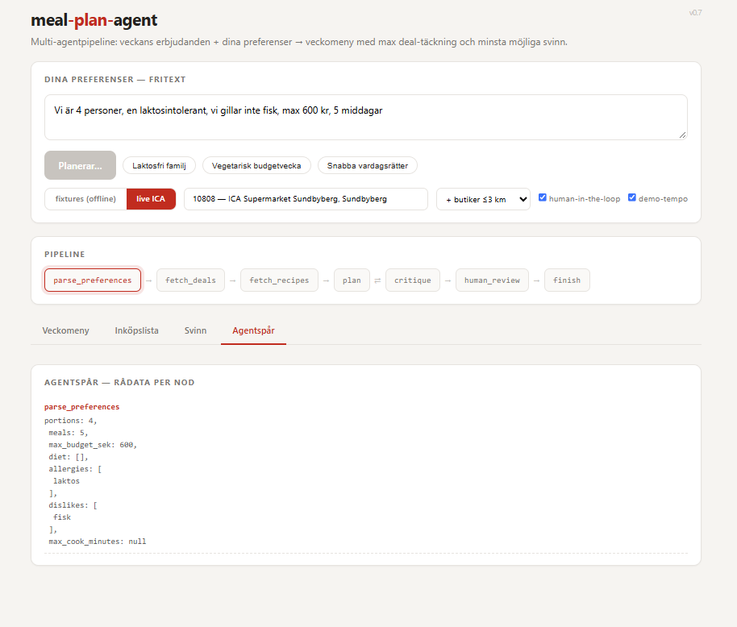
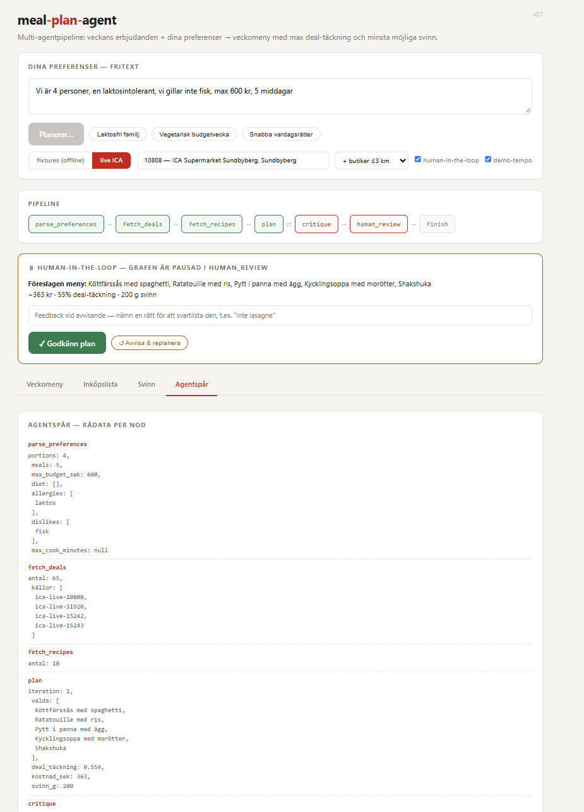
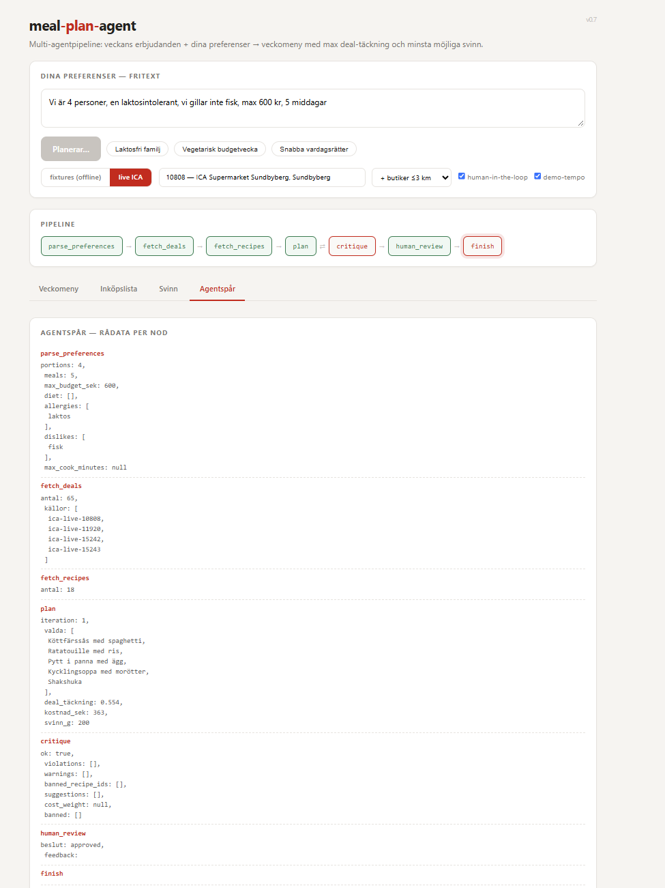
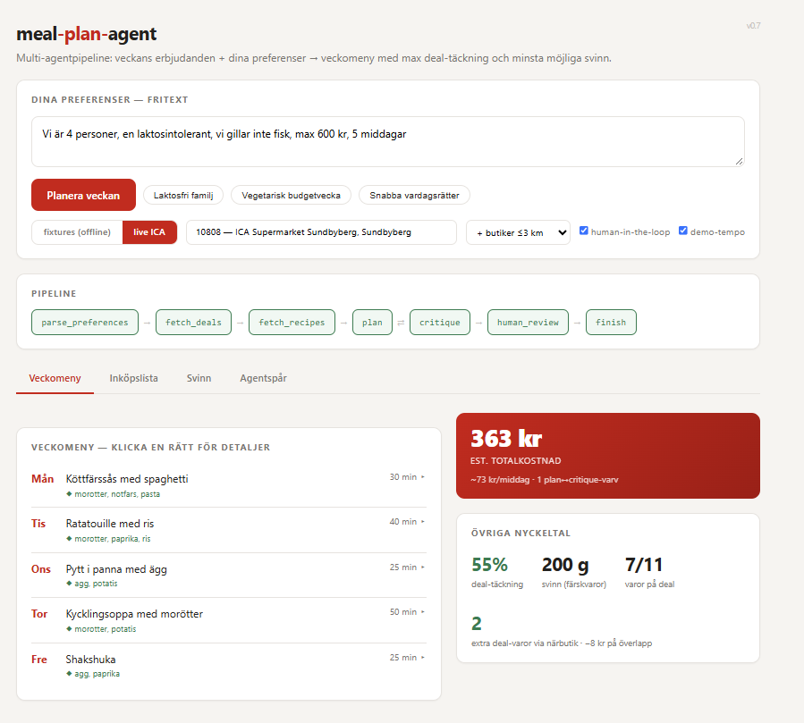
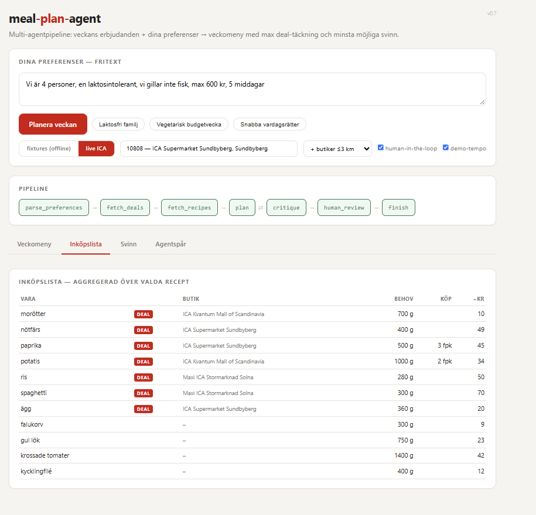
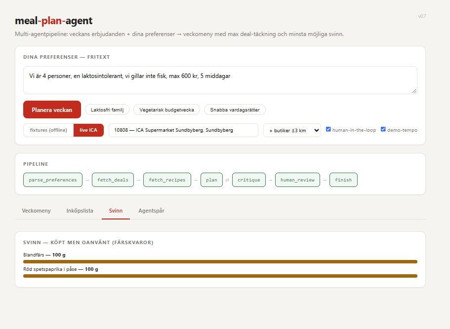
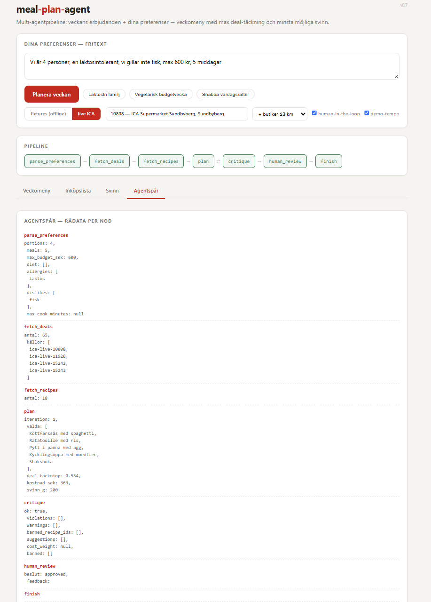
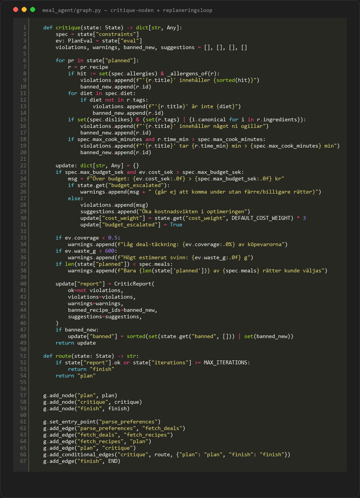
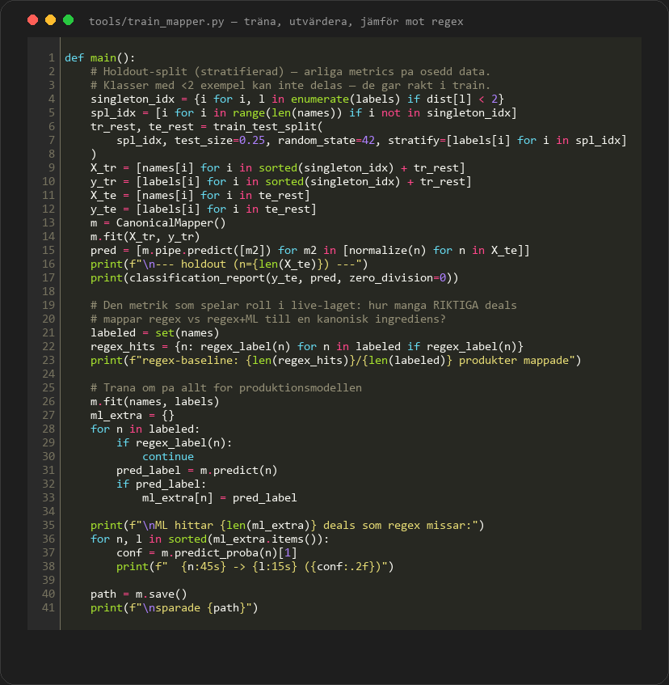

# Meal Plan Agent — multi-agent pipeline

## What this is

A graph-orchestrated multi-agent pipeline (Python + **LangGraph**) that composes
a weekly dinner plan from **this week's actual ICA offers** and free-text
preferences in Swedish — optimising for **maximum deal coverage** and
**minimum fresh-food waste**:

> *"Vi är 4 personer, en laktosintolerant, vi gillar inte fisk, max 600 kr, 5 middagar"*
> → weekly menu + aggregated shopping list + waste report + cost estimate

The design principle: **deterministic code owns the numbers, the agents own the
flow.** Optimisation, constraint checking and waste math are plain Python;
the agents orchestrate, verify and escalate. The whole pipeline runs fully
offline against fixtures — an LLM is a pluggable enhancement, not a dependency.

## The agent graph

| Node | Role |
|---|---|
| `parse_preferences` | Free text (Swedish) → `ConstraintSpec` — portions, meals, budget, diet, allergies, dislikes, max cook time. Rule-based parser by default; OpenAI structured output when `MEAL_AGENT_LLM=openai`. |
| `fetch_deals` | `DealsProvider` → `Deal[]`. `FixtureDeals` (deterministic default) or `IcaLiveDeals` (live offers via the same public gateway the ICA frontend uses). |
| `fetch_recipes` | `RecipeProvider` → `Recipe[]` (Swedish everyday dishes). |
| `plan` | Calls the optimizer: hard filters (allergens/diet/dislikes/time) → greedy selection + swap improvement over `deal_grams − 0.5·waste − w·cost`. |
| `critique` | Verifies the plan against all constraints. Violations → recipes blacklisted, replan; budget breach → cost weight ×3 escalation. Warnings are reported honestly. |
| `human_review` | *(optional HITL)* The graph **pauses** via `interrupt()` + checkpointer and waits for human approval. Rejection loops back to `plan`; feedback naming a dish blacklists it. |
| `finish` | Builds `MealPlan`: menu, aggregated shopping list, waste report. |

Orchestration is a LangGraph `StateGraph` with **conditional routing** — the
`critique → plan` edge is data-driven (violations in state), not a hardcoded
loop. Bounded by `MAX_ITERATIONS`; when a target is impossible the critic
reports a warning instead of looping forever.

## Human-in-the-loop, on and off

The same graph runs both ways — a checkbox/`--hitl` flag inserts the
`human_review` node between `critique` and `finish`:

- **Without HITL:** `critique ok → finish`, fully automatic.
- **With HITL:** `critique ok → human_review`, graph suspends (`interrupt()`
  + `MemorySaver` checkpoint). Approving resumes to `finish`; rejecting
  replans with the human's feedback folded into state.

The resume path is a second SSE stream (`/api/plan/resume`) that continues the
*same* checkpointed run — the agent trace shows `human_review` as a real node
with `beslut: approved` (screenshots below).

## Why the design choices matter

- **Provider abstraction + DI** — the same graph runs fixtures in tests and
  live ICA in production. The unofficial ICA endpoints are isolated behind
  `DealsProvider`, so when they change, only one file breaks.
- **Zero-LLM baseline** — everything works offline; an LLM would improve the
  parser but never owns the math. Product→ingredient mapping is a trained
  classifier, not an LLM call.
- **Real ML, honestly scoped** — `CanonicalMapper` (TF-IDF char-ngrams +
  logistic regression) trained on 282 hand-labelled live ICA product names.
  It only fires as a fallback when regex misses, returns `None` below its
  confidence threshold, and is evaluated against the regex baseline:
  0.71 holdout accuracy / +8 deals caught per week that regex drops.
- **Critic loop with escalation** — not just "try again": the critic feeds
  structured feedback (blacklist, parameter changes) that alters the planner's
  behaviour next iteration. An impossible budget yields an honest warning,
  not an infinite loop.
- **Deterministic optimisation** — waste and cost are computed exactly
  (per-package `pack_g`, perishable flags), not guessed by a model.
- **Pydantic contracts between nodes** — every message in state is validated
  and serialisable, which is what makes SSE streaming, checkpoints and the
  agent trace possible.

## Live ICA integration

`IcaLiveDeals` uses the same public gateway as ica.se's own frontend:

1. `handla.ica.se/api/store/v1` — the store registry (354 stores)
2. `ica.se/e11/public-access-token` — anonymous Bearer token
3. `apim-pub.gw.ica.se/sverige/digx/offerreader/v1/offers/store/{id}` — the
   store's weekly offers

Product names are mapped to canonical ingredients in two stages: regex
hints first (high precision), then the trained `CanonicalMapper` as
fallback for what regex misses (high recall at a confidence threshold —
it can only *add* deals, never silently mislabel them). ML-mapped items
are tagged `ML` in the shopping list and counted as `ml_mappade` in the
agent trace, so the component is visible rather than implicit. Live runs
typically land at 25–60 % deal coverage, which the critic flags
honestly rather than hiding.

**Nearby stores:** the store registry carries lat/lon, so `nearby_stores()`
merges offers from every ICA within a chosen radius (haversine, deduped by
offer id). In dense areas that lifts deal coverage markedly (a Sundbyberg run
merged 4 stores → 65 offers, 55 % coverage) and the UI reports the honest
split: *extra deal items only available nearby* vs *kr saved on overlapping
deals*. Honestly a dense-city feature — on the countryside the radius usually
contains just your own store, and the merge degrades gracefully to that.

## Screenshots

**Controls** — live ICA, store search, nearby-radius, HITL toggle, demo tempo:

**HITL pause** — the graph suspended in `human_review`; trace shows 4 merged
store sources and the proposed plan awaiting approval:

**Approved** — `beslut: approved` lands in the trace and the graph resumes:

**Result** — menu + KPI + the nearby-store stats ("2 extra deal items via
nearby store · −8 kr on overlap"):

**Per-store shopping list** — each deal item tagged with the store where it's
cheapest:

**Waste model** — only perishables count as waste:

**Full agent trace** — every node's raw output, auditable:

## The code

The critic node + conditional routing — the part that makes this
multi-agent rather than a single call:

The ML training script — the split matters: singleton classes can't be
stratified so they go straight into training, the rest get a 75/25
holdout for honest metrics, and the comparison that counts is against
the regex baseline on *all* 282 real product names:

## Stack

Python 3.13 · LangGraph (StateGraph, conditional edges, `interrupt`,
checkpointer) · Pydantic · FastAPI + SSE · scikit-learn (product
classifier) · vanilla JS frontend · pytest

## Repo layout

Full source lives in its own repository (`meal-plan-agent`):
`meal_agent/` — `graph.py` (nodes + routing), `optimizer.py` (selection +
waste math), `models.py` (pydantic contracts), `mapper.py` (TF-IDF +
logreg product classifier), `providers/` (fixtures + live ICA),
`web.py` (FastAPI + SSE), `static/index.html`, `tests/`,
`tools/` (`collect_products.py` + `train_mapper.py` for the ML pipeline,
asset generators for the diagrams above).
