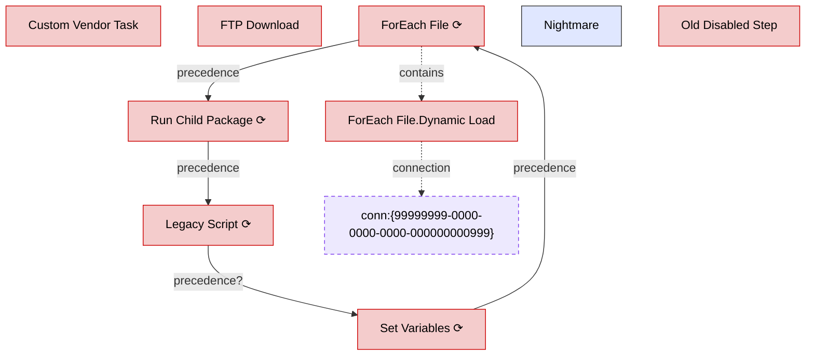

```mermaid
flowchart TD
    classDef pkg fill:#e0e7ff,stroke:#333,color:#000
    classDef cont fill:#f1f5f9,stroke:#333,color:#000
    classDef sql fill:#dbeafe,stroke:#333,color:#000
    classDef df fill:#fed7aa,stroke:#333,color:#000
    classDef expr fill:#fef9c3,stroke:#333,color:#000
    classDef script fill:#fecaca,stroke:#333,color:#000
    classDef conn fill:#ede9fe,stroke:#7c3aed,color:#000,stroke-dasharray:5 4
    classDef ext fill:#fff,stroke:#dc2626,color:#000,stroke-dasharray:5 4
    classDef task fill:#dcfce7,stroke:#333,color:#000
    classDef trap fill:#f4cccc,stroke:#c00,color:#000
    nCustom_Vendor_Task["Custom Vendor Task"]:::trap
    nFTP_Download["FTP Download"]:::trap
    nForEach_File["ForEach File ⟳"]:::trap
    nForEach_File_Dynamic_Load["ForEach File.Dynamic Load"]:::trap
    nLegacy_Script["Legacy Script ⟳"]:::trap
    nNightmare["Nightmare"]:::pkg
    nOld_Disabled_Step["Old Disabled Step"]:::trap
    nRun_Child_Package["Run Child Package ⟳"]:::trap
    nSet_Variables["Set Variables ⟳"]:::trap
    nconn__99999999_0000_0000_0000_000000000999_["conn:{99999999-0000-0000-0000-000000000999}"]:::conn
    nForEach_File -.->|contains| nForEach_File_Dynamic_Load
    nForEach_File -->|precedence| nRun_Child_Package
    nForEach_File_Dynamic_Load -.->|connection| nconn__99999999_0000_0000_0000_000000000999_
    nLegacy_Script -->|precedence?| nSet_Variables
    nRun_Child_Package -->|precedence| nLegacy_Script
    nSet_Variables -->|precedence| nForEach_File
```
