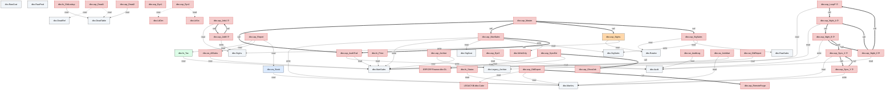

```mermaid
flowchart TD
    classDef tbl fill:#f1f5f9,stroke:#333,color:#000
    classDef view fill:#dbeafe,stroke:#333,color:#000
    classDef proc fill:#fed7aa,stroke:#333,color:#000
    classDef fn fill:#dcfce7,stroke:#333,color:#000
    classDef ext fill:#ede9fe,stroke:#7c3aed,color:#000,stroke-dasharray:5 4
    classDef miss fill:#fff,stroke:#dc2626,color:#000,stroke-dasharray:5 4
    classDef trap fill:#f4cccc,stroke:#c00,color:#000
    nERPCRP_Finance_dbo_GL["ERPCRP.Finance.dbo.GL"]:::trap
    nLEGACY_BI_dbo_Cube["LEGACY.BI.dbo.Cube"]:::trap
    ndbo_Audit["dbo.Audit"]:::tbl
    ndbo_DeadRef["dbo.DeadRef"]:::tbl
    ndbo_DeadTable["dbo.DeadTable"]:::tbl
    ndbo_Legacy_Archive["dbo.Legacy_Archive"]:::tbl
    ndbo_LitDim["dbo.LitDim"]:::trap
    ndbo_LitSrc["dbo.LitSrc"]:::trap
    ndbo_MartInv["dbo.MartInv"]:::tbl
    ndbo_MartSales["dbo.MartSales"]:::tbl
    ndbo_RawCust["dbo.RawCust"]:::tbl
    ndbo_RawInv["dbo.RawInv"]:::tbl
    ndbo_RawProd["dbo.RawProd"]:::tbl
    ndbo_RawSales["dbo.RawSales"]:::tbl
    ndbo_StgCust["dbo.StgCust"]:::tbl
    ndbo_StgInv["dbo.StgInv"]:::tbl
    ndbo_StgSales["dbo.StgSales"]:::tbl
    ndbo_WriteOnly["dbo.WriteOnly"]:::trap
    ndbo_fn_OldLookup["dbo.fn_OldLookup"]:::trap
    ndbo_fn_Price["dbo.fn_Price"]:::trap
    ndbo_fn_Status["dbo.fn_Status"]:::trap
    ndbo_fn_Tax["dbo.fn_Tax"]:::fn
    ndbo_usp_Archive["dbo.usp_Archive"]:::trap
    ndbo_usp_AuditTrail["dbo.usp_AuditTrail"]:::trap
    ndbo_usp_Dead1["dbo.usp_Dead1"]:::trap
    ndbo_usp_Dead2["dbo.usp_Dead2"]:::trap
    ndbo_usp_Dyn1["dbo.usp_Dyn1"]:::trap
    ndbo_usp_Dyn2["dbo.usp_Dyn2"]:::trap
    ndbo_usp_Dyn3["dbo.usp_Dyn3"]:::trap
    ndbo_usp_GhostJob["dbo.usp_GhostJob"]:::trap
    ndbo_usp_JobA["dbo.usp_JobA ⟳"]:::trap
    ndbo_usp_JobB["dbo.usp_JobB ⟳"]:::trap
    ndbo_usp_LoopP["dbo.usp_LoopP ⟳"]:::trap
    ndbo_usp_MartSales["dbo.usp_MartSales"]:::trap
    ndbo_usp_Master["dbo.usp_Master"]:::trap
    ndbo_usp_Night_A["dbo.usp_Night_A ⟳"]:::trap
    ndbo_usp_Night_B["dbo.usp_Night_B ⟳"]:::trap
    ndbo_usp_Night_C["dbo.usp_Night_C ⟳"]:::trap
    ndbo_usp_OldExport["dbo.usp_OldExport"]:::trap
    ndbo_usp_RemotePurge["dbo.usp_RemotePurge"]:::trap
    ndbo_usp_Report["dbo.usp_Report"]:::trap
    ndbo_usp_StgInv["dbo.usp_StgInv"]:::proc
    ndbo_usp_StgSales["dbo.usp_StgSales"]:::trap
    ndbo_usp_SyncExt["dbo.usp_SyncExt"]:::trap
    ndbo_usp_Sync_X["dbo.usp_Sync_X ⟳"]:::trap
    ndbo_usp_Sync_Y["dbo.usp_Sync_Y ⟳"]:::trap
    ndbo_vw_AllSales["dbo.vw_AllSales"]:::trap
    ndbo_vw_AuditLog["dbo.vw_AuditLog"]:::trap
    ndbo_vw_JoinMart["dbo.vw_JoinMart"]:::trap
    ndbo_vw_OldReport["dbo.vw_OldReport"]:::trap
    ndbo_vw_Stock["dbo.vw_Stock"]:::view
    ndbo_fn_OldLookup -->|read| ndbo_DeadTable
    ndbo_fn_Price -->|read| ndbo_MartSales
    ndbo_fn_Status -->|read| ndbo_MartInv
    ndbo_fn_Tax -->|read| ndbo_MartSales
    ndbo_usp_Archive -->|write| ndbo_Legacy_Archive
    ndbo_usp_Archive -->|read| ndbo_MartSales
    ndbo_usp_AuditTrail -->|write| ndbo_Audit
    ndbo_usp_AuditTrail -->|read| ndbo_MartSales
    ndbo_usp_Dead1 -.->|read| ndbo_DeadRef
    ndbo_usp_Dead1 -.->|read| ndbo_DeadTable
    ndbo_usp_Dead2 -->|read| ndbo_DeadTable
    ndbo_usp_Dyn2 -.->|read| ndbo_LitDim
    ndbo_usp_Dyn2 -.->|read| ndbo_LitSrc
    ndbo_usp_Dyn3 -->|read| ndbo_Audit
    ndbo_usp_JobA -->|read| ndbo_StgInv
    ndbo_usp_JobA ==>|call| ndbo_usp_JobB
    ndbo_usp_JobB -->|write| ndbo_StgInv
    ndbo_usp_JobB ==>|call| ndbo_usp_JobA
    ndbo_usp_LoopP -->|read| ndbo_Legacy_Archive
    ndbo_usp_LoopP ==>|call| ndbo_usp_Night_A
    ndbo_usp_MartSales -->|write| ndbo_MartInv
    ndbo_usp_MartSales -->|write| ndbo_MartSales
    ndbo_usp_MartSales -->|read| ndbo_StgCust
    ndbo_usp_MartSales -->|read| ndbo_StgSales
    ndbo_usp_MartSales -->|write| ndbo_WriteOnly
    ndbo_usp_MartSales ==>|call| ndbo_usp_AuditTrail
    ndbo_usp_Master ==>|call| ndbo_usp_AuditTrail
    ndbo_usp_Master ==>|call| ndbo_usp_MartSales
    ndbo_usp_Master ==>|call| ndbo_usp_StgInv
    ndbo_usp_Master ==>|call| ndbo_usp_StgSales
    ndbo_usp_Night_A -->|read| ndbo_MartSales
    ndbo_usp_Night_A ==>|call| ndbo_usp_Night_B
    ndbo_usp_Night_B -->|write| ndbo_Audit
    ndbo_usp_Night_B ==>|call| ndbo_usp_Night_C
    ndbo_usp_Night_B ==>|call| ndbo_usp_Sync_X
    ndbo_usp_Night_C -->|read| ndbo_Audit
    ndbo_usp_Night_C ==>|call| ndbo_usp_LoopP
    ndbo_usp_Night_C ==>|call| ndbo_usp_Night_A
    ndbo_usp_OldExport -->|read| nLEGACY_BI_dbo_Cube
    ndbo_usp_OldExport -->|read| ndbo_MartInv
    ndbo_usp_OldExport ==>|call| ndbo_usp_RemotePurge
    ndbo_usp_Report -->|read| ndbo_fn_Tax
    ndbo_usp_Report -->|read| ndbo_vw_AllSales
    ndbo_usp_Report -->|read| ndbo_vw_Stock
    ndbo_usp_StgInv -->|read| ndbo_RawInv
    ndbo_usp_StgInv -->|write| ndbo_StgInv
    ndbo_usp_StgSales -->|read| ndbo_RawInv
    ndbo_usp_StgSales -->|read| ndbo_RawSales
    ndbo_usp_StgSales -->|write| ndbo_StgSales
    ndbo_usp_SyncExt -->|read| nERPCRP_Finance_dbo_GL
    ndbo_usp_SyncExt -->|read| ndbo_MartSales
    ndbo_usp_SyncExt ==>|call| ndbo_usp_GhostJob
    ndbo_usp_Sync_X -->|read| ndbo_MartInv
    ndbo_usp_Sync_X ==>|call| ndbo_usp_Sync_Y
    ndbo_usp_Sync_Y -->|write| ndbo_MartInv
    ndbo_usp_Sync_Y ==>|call| ndbo_usp_Sync_X
    ndbo_vw_AllSales -->|read| ndbo_MartSales
    ndbo_vw_AuditLog -->|read| ndbo_Audit
    ndbo_vw_JoinMart -->|read| ndbo_MartInv
    ndbo_vw_JoinMart -->|read| ndbo_MartSales
    ndbo_vw_OldReport -->|read| ndbo_MartSales
    ndbo_vw_Stock -->|read| ndbo_MartInv
```
