# Statistical Programming & Machine Learning — Final Assignment

> End-to-end ML in scikit-learn: regression, classification, decision trees, ensembles, clustering and dimensionality reduction — applied to four different datasets.

Final assignment for the *Statistical Programming & ML* course at Nackademin (BI24).

## What this project demonstrates

- **Regression** — multiple linear regression with a 3D fitted surface
- **Classification** — logistic regression, decision trees, random forest, SVM
- **Unsupervised learning** — k-means (worked by hand *and* in code), PCA, elbow method, silhouette scores
- **Model evaluation** — train/test splits, R², accuracy, confusion matrices, feature importance
- **Honest interpretation** — including where tiny datasets break the models

## Q1: Used car sales — price & speed of sale

**Linear regression** predicting price from engine size and mileage:

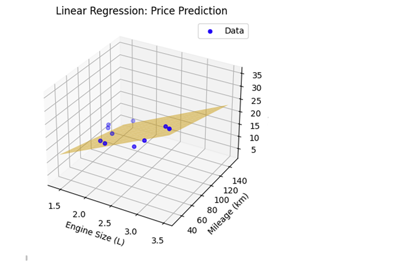

**Logistic regression** classifying whether a car sells within 7 days:

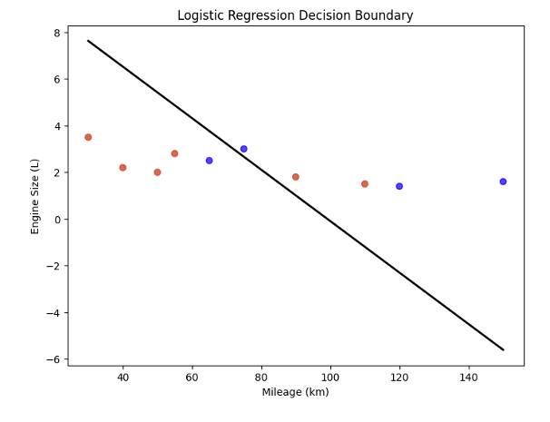

*Result:* train R² = 0.94, but test R² = −25 — see [limitations](#honest-limitations). Logistic accuracy 0.5 on the 2-point test set.

## Q2: Why software projects fail

Decision tree and random forest on project outcomes (team size, QA coverage, schedule, tech stack):

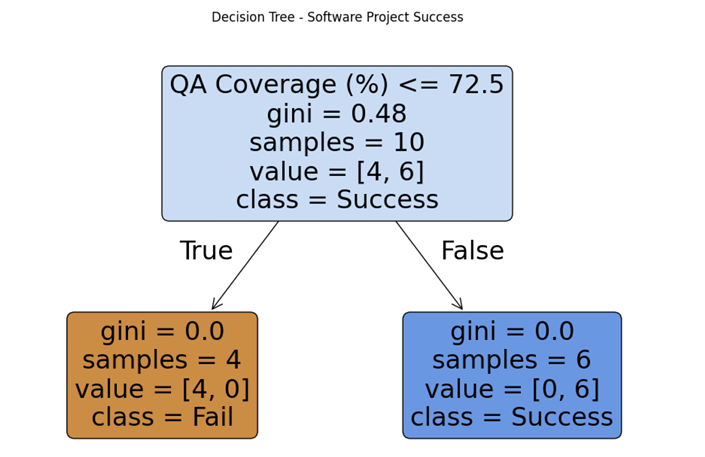

The tree found a single clean split: **all 4 projects with QA coverage ≤ 72.5% failed; all 6 above it succeeded.**

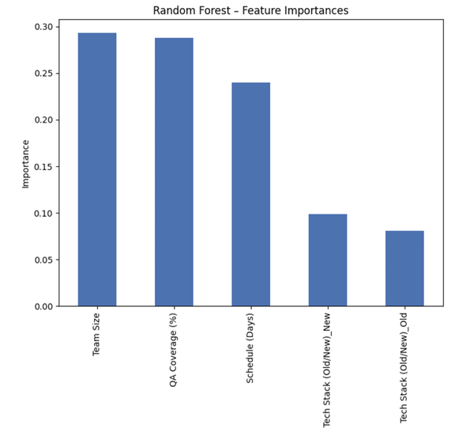

The random forest's feature importances agree — team size, QA coverage and schedule dominate; tech stack barely registers.

## Q3: K-means worked by hand

Manual k-means iteration on coffee bean quality (aroma score vs. acidity level): euclidean distances, cluster assignment, centroid update.

| Step | |
|---|---|
| Distance calculations | 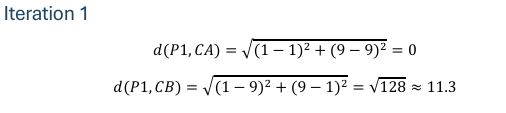 |
| Cluster assignment table | 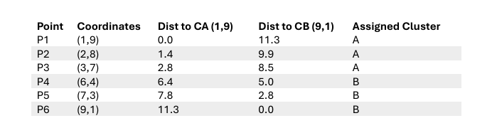 |
| New centroids | 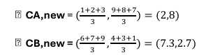 |
| Result | 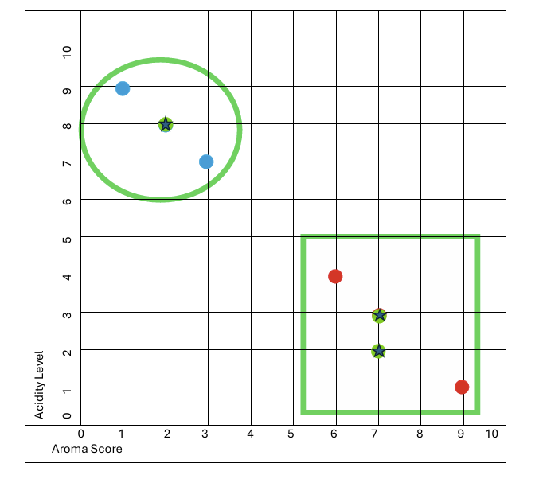 |

## Q4: Wine dataset — unsupervised vs. supervised

Choosing K on the sklearn wine dataset — elbow method and silhouette scores both point to **K = 3**:

| Elbow | PCA | Silhouette |
|---|---|---|
| 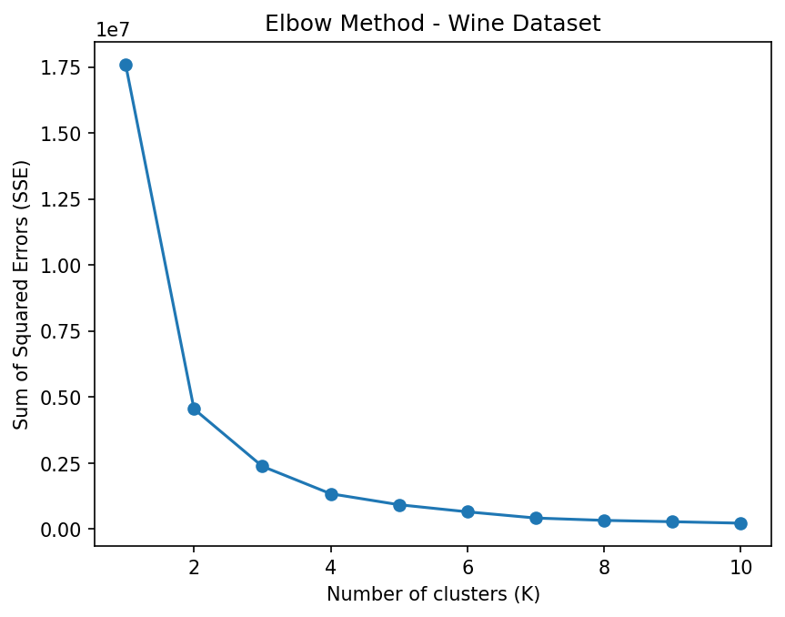 | 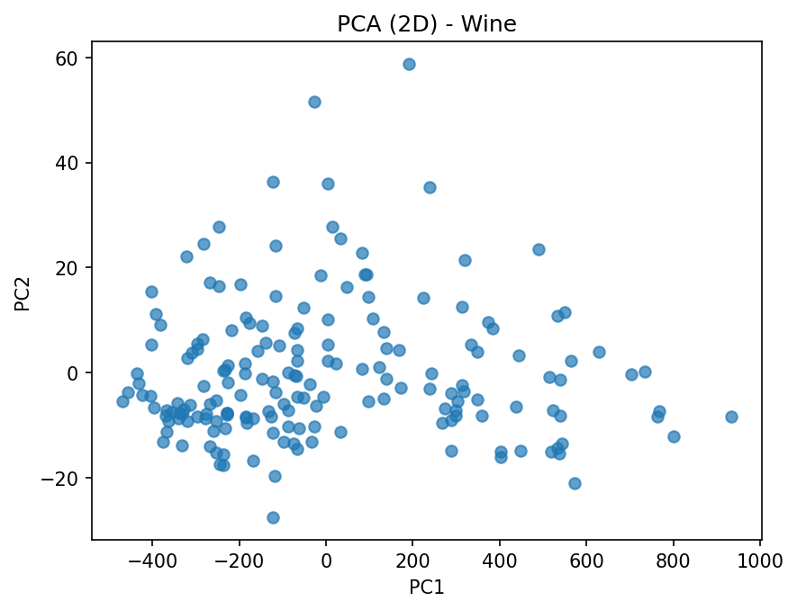 | 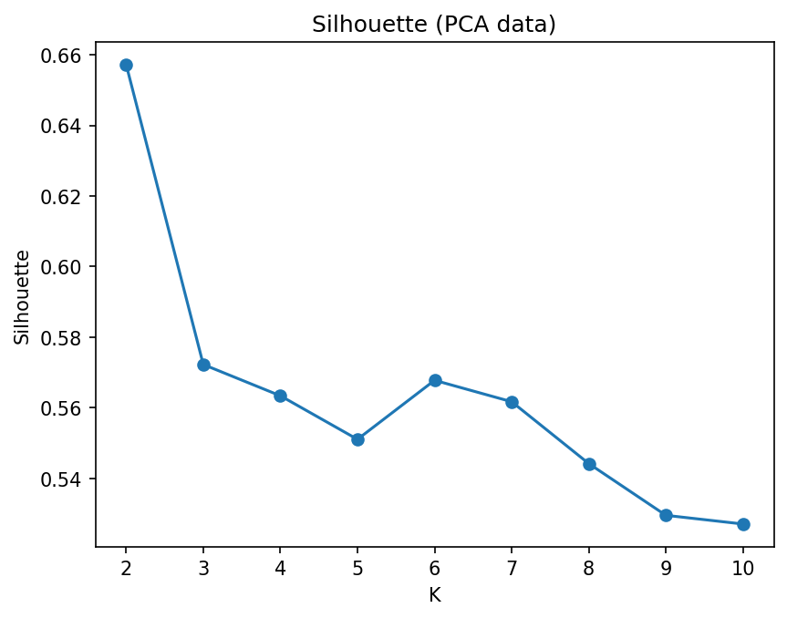 |

Random forest vs. SVM on the same data — RF classified the test set perfectly, the SVM wildcard made mistakes:

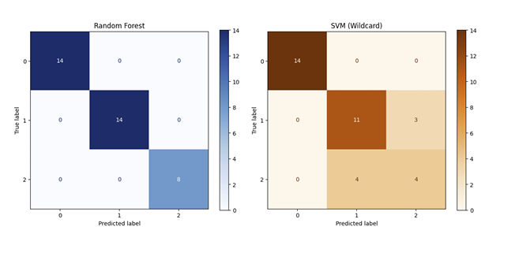

The "tri-view" reality check — same data, three different labelings:

| Math clusters (k-means) | Model predictions (RF) | Actual labels |
|---|---|---|
| 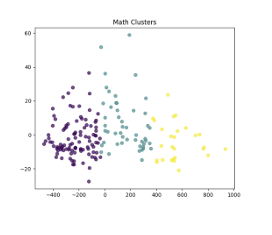 | 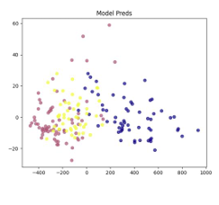 | 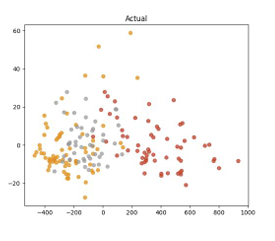 |

## Honest limitations

- **Tiny datasets.** The car data has 10 rows; an 80/20 split leaves 2 test points — which is why test R² is −25 despite train R² = 0.94. The model memorizes rather than generalizes. Key takeaway: dataset size constrains what a model can prove more than algorithm choice does.
- **Accuracy 0.5 on the logistic model** is effectively a coin flip — same underlying cause.
- These are course datasets designed to demonstrate method, not to support production-grade claims.

## Files

- `final.malin_jacobsson.ipynb` — the full notebook (verified runnable with `pandas`, `scikit-learn`, `matplotlib`, `seaborn`, `openpyxl`)
- `final.malin_jacobsson.pdf` — report including the written analysis
- `final_data.xlsx` — the three datasets (used cars, software projects, coffee beans)
